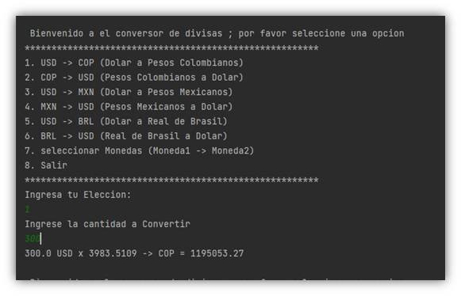
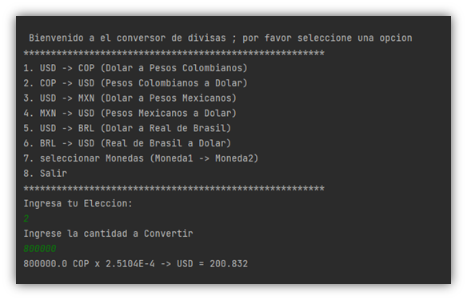

<h1 align="center">Conversor de Monedas en Java con ExchangeRate-API</h1>

Buen dia, mi nombre es Abelino Suarez ,este proyecto es un conversor de monedas sencillo en Java que utiliza la API de ExchangeRate-API para obtener las tasas de cambio actualizadas y realizar la conversión entre diferentes monedas.

<h2>Introducción</h2>

El conversor de monedas es una aplicación de línea de comandos que permite a los usuarios convertir el valor de una moneda a otra utilizando tasas de cambio actualizadas proporcionadas por la API de ExchangeRate-API. La aplicación utiliza la biblioteca Gson para analizar la respuesta JSON de la API, realizar la conversión y generar un historial de consultas.

<h2>Uso del programa</h2>

 Para utilizar el conversor de monedas, sigue estos pasos:

1. Clona el repositorio en tu máquina local.
2. Compila el programa utilizando el comando javac ConversorDeMonedas.java.
3. Ejecuta el programa utilizando el comando java ConversorDeMonedas.
4. Sigue las instrucciones en pantalla para ingresar el monto a convertir y la moneda de origen y destino.
Aquí hay un ejemplo de cómo se ve la aplicación en acción:

Ejemplo de uso del conversor de monedas

<h2>Requisitos</h2>

 Para utilizar el conversor de monedas, necesitarás lo siguiente:

1. Preferiblemente usar JDK 21 o superior instalado en tu máquina local.
2. agregar La biblioteca Gson a tu proyecto. Puedes descargar el JAR desde el sitio web de Gson o agregar la dependencia a tu archivo build.gradle o pom.xml si estás utilizando Gradle o Maven, respectivamente.
3. Una clave de API válida de ExchangeRate-API. Puedes obtener una clave de API gratuita registrándote en el sitio web de ExchangeRate-API.

<h2>Aclaraciones</h2>

 El conversor de monedas es una herramienta útil para cualquier persona que necesite realizar transacciones en diferentes monedas o que desee mantenerse informada sobre las fluctuaciones en los mercados financieros globales de divisas. Esperamos que este proyecto te sea útil y te animes a contribuir con mejoras y nuevas funcionalidades. ¡Gracias por usar el conversor de monedas en Java con ExchangeRate-API! 

<h3> Palabras clave</h3>
Conversor de monedas, Java, ExchangeRate-API, línea de comandos, tasas de cambio, Gson, JDK, Maven, Gradle, API key.